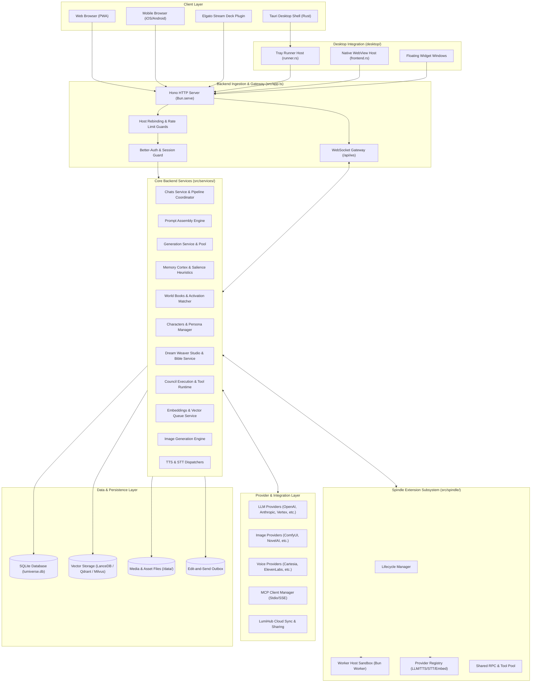
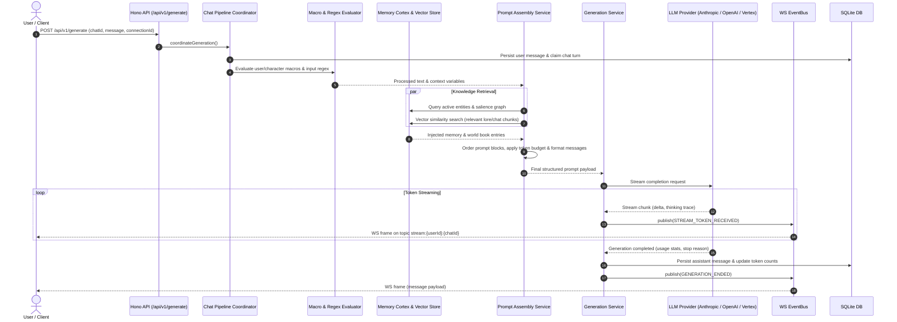
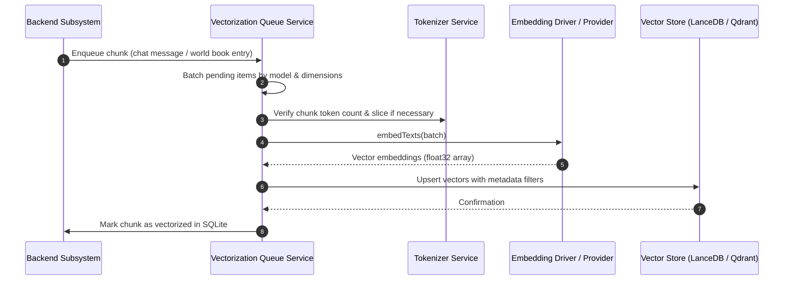
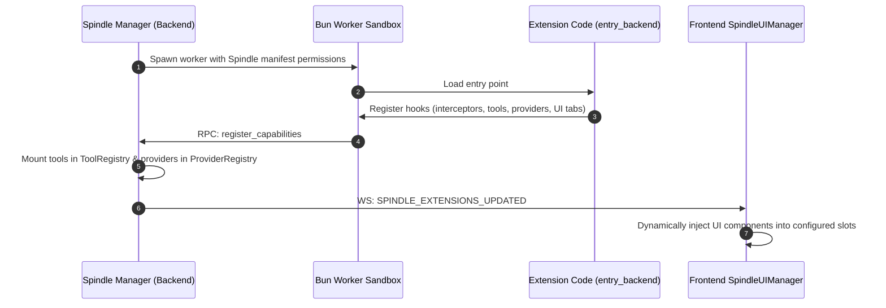
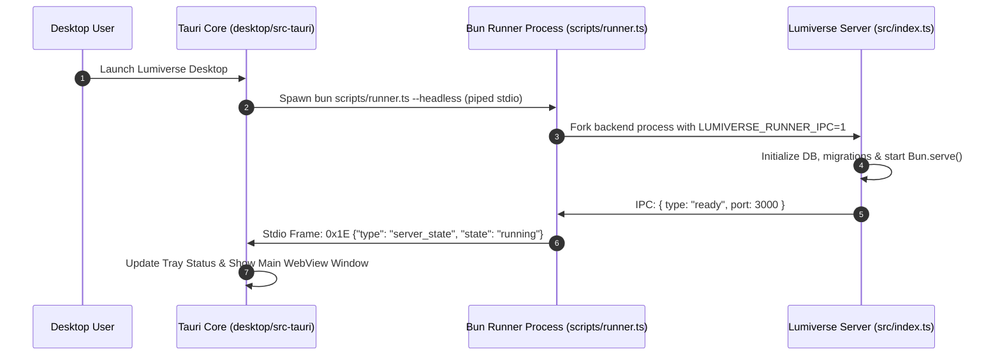

# Architecture

**Analysis Date:** 2026-08-17

## Executive Summary

Lumiverse is a self-hostable, multi-user, multi-tenant AI character interaction platform, prompt engineering environment, and extension host. It provides a modular backend built on **Bun** and **Hono**, a responsive reactive frontend using **React 19**, **Vite**, **Zustand**, and **CSS Modules**, and an experimental native desktop shell powered by **Tauri v2** (Rust).

Key capabilities include:
- Multi-provider LLM text generation with token streaming, tool calling, reasoning/thinking trace support, and prompt assembly.
- Long-term memory extraction and recall via **Memory Cortex** (graph + heuristics + vector embeddings) and **Databanks**.
- Dynamic plugin system (**Spindle**) supporting sandboxed worker threads, custom UI placements, external API providers (LLMs, TTS, STT, Embeddings), and dynamic tool calling.
- Multi-engine vector search abstraction supporting **LanceDB** (embedded), **Qdrant**, and **Milvus**.
- Real-time event pub/sub with session tracking, chat focus tracking, and low-latency multiplayer rooms over native WebSockets.
- Zero-external-dependency local deployment with SQLite (WAL mode), encrypted credentials/secrets, and headless runner process management.

---

## System Overview Diagram

---

## Component Responsibilities

### 1. Backend Gateway & Routing (`src/app.ts`, `src/routes/`)
- **HTTP Routing & API Endpoint Aggregation**: Uses [Hono](https://hono.dev/) to mount 40+ RESTful sub-routers under `/api/v1/*` (chats, characters, world-books, connections, presets, memory-cortex, weaver, etc.).
- **Security & Network Perimeter**:
  - Validates `Host` and `Origin` headers via [`src/services/trusted-hosts.service.ts`](file:///G:/AI/All%20lumiverse%20repos/Lumiverse/src/services/trusted-hosts.service.ts) to prevent DNS rebinding attacks.
  - Applies selective rate limiting (`src/middleware/rate-limit.ts`) and tracks failed attempts via [`src/services/auth-lockout.service.ts`](file:///G:/AI/All%20lumiverse%20repos/Lumiverse/src/services/auth-lockout.service.ts).
  - Enforces body size restrictions (1 MB on public auth endpoints, 10 MB on standard routes, and exempted streaming/charx imports up to 5 GB).
- **Authentication**: Integrates [Better-Auth](https://better-auth.com/) for email/password and SSO credentials, with custom session resolution and single-use WebSocket ticket issuance (`src/ws/tickets.ts`).

### 2. Core Service Layer (`src/services/`)
- **Prompt Assembly Engine ([`src/services/prompt-assembly.service.ts`](file:///G:/AI/All%20lumiverse%20repos/Lumiverse/src/services/prompt-assembly.service.ts))**:
  - Evaluates macro expressions (`src/macros/`).
  - Executes associative regex scripts (`src/services/regex-scripts.service.ts`).
  - Matches and pins activated World Book entries (`src/services/world-info-activation.service.ts`).
  - Queries semantic memory via Memory Cortex (`src/services/memory-cortex/`) and Databanks (`src/services/databank/`).
  - Orders prompt blocks, enforces context window limits, and formats role messages for downstream models.
- **Generation & LLM Orchestration ([`src/services/generate.service.ts`](file:///G:/AI/All%20lumiverse%20repos/Lumiverse/src/services/generate.service.ts))**:
  - Resolves connection profiles, overrides, and credential secrets (`src/services/secrets.service.ts`).
  - Streams response chunks from unified LLM providers (`src/llm/providers/`) or Spindle dynamic providers.
  - Manages abort signals, generation pool state, tool continuation loops, and reasoning trace stripping.
- **Memory Cortex Subsystem ([`src/services/memory-cortex/`](file:///G:/AI/All%20lumiverse%20repos/Lumiverse/src/services/memory-cortex/))**:
  - Maintains knowledge graphs (entities, mentions, relations) with salience scoring, decay heuristics, and vault chunking.
  - Uses background worker processes to run entity extraction, emotion analysis, and consolidation without blocking the main event loop.
- **Dream Weaver Studio ([`src/services/weaver/`](file:///G:/AI/All%20lumiverse%20repos/Lumiverse/src/services/weaver/))**:
  - Interactive multi-stage character and world creation pipeline.
  - Executes guided interviews, dynamic slot extraction, lorebook synthesis, and story bible governance.

### 3. Spindle Extension Subsystem (`src/spindle/`)
- **Worker Host & Isolation ([`src/spindle/worker-host.ts`](file:///G:/AI/All%20lumiverse%20repos/Lumiverse/src/spindle/worker-host.ts))**:
  - Runs extension backends inside isolated Bun Worker threads using structured message passing (`WorkerToHost` / `HostToWorker`).
  - Mediates capability-based access to core APIs (content, storage, state, process, image generation, memory).
- **Dynamic Provider Registry ([`src/spindle/provider-registry.ts`](file:///G:/AI/All%20lumiverse%20repos/Lumiverse/src/spindle/provider-registry.ts))**:
  - Allows extensions to dynamically register LLM, embedding, TTS, STT, and sidecar providers.
  - Employs a secure broker architecture that shields credentials and forwards validated requests across scopes (`system`, `operator`, `user`).
- **UI Extension Registry ([`src/spindle/ui-registry.ts`](file:///G:/AI/All%20lumiverse%20repos/Lumiverse/src/spindle/ui-registry.ts))**:
  - Mounts extension bundles into predefined frontend slots (dock panels, settings tabs, character tabs, float widgets, message actions).

### 4. Real-time Pub/Sub & Multiplayer Layer (`src/ws/`, `src/multiplayer/`)
- **EventBus ([`src/ws/bus.ts`](file:///G:/AI/All%20lumiverse%20repos/Lumiverse/src/ws/bus.ts))**:
  - Native WebSocket topic-based broadcast using Bun's server pub/sub engine.
  - Topic hierarchy: `user:{userId}`, `stream:{userId}:{chatId}`, `room:{roomId}`, `room:{roomId}:feed`.
  - Manages heartbeat liveness, focused chat tracking, and visibility state.
- **Multiplayer Service ([`src/services/multiplayer.service.ts`](file:///G:/AI/All%20lumiverse%20repos/Lumiverse/src/services/multiplayer.service.ts))**:
  - Orchestrates collaborative group chat rooms with turn-taking policies, participant presence, and cryptographic room tokens (`src/crypto/room-token.ts`).
  - Supports peer-to-peer and relayed synchronization via remote identity servers.

### 5. Persistence & Vector Layer (`src/db/`, `src/services/vector-store/`)
- **SQLite Relational Store**:
  - Managed via `bun:sqlite` with WAL journal mode, explicit busy timeouts, and synchronous maintenance sweeps (`src/db/maintenance.ts`).
  - Over 100 sequential schema migrations (`src/db/migrations/`).
  - Prepared statement cache invalidation via monotonically incremented database generation counters (`src/db/connection.ts`).
- **Unified Vector Storage**:
  - Abstraction layer (`src/services/vector-store/types.ts`) supporting **LanceDB** (default local embedded store), **Qdrant**, and **Milvus**.
  - Background vectorization queues for chat chunks, world books, and memory cortex vaults (`src/services/vectorization-queue.service.ts`).

### 6. Desktop Integration Layer (`desktop/`)
- **Tauri v2 Native Shell**:
  - Written in Rust (`desktop/src-tauri/src/`).
  - Supervises the backend runner process over headless stdio protocol frames (`0x1E` prefix delimiter).
  - Manages the system tray, launch-at-login, native window appearance (vibrancy/blur for translucent themes), and independent floating widget WebViews.

### 7. Frontend SPA Architecture (`frontend/src/`)
- **React 19 Application Shell**:
  - Entry point at [`frontend/src/main.tsx`](file:///G:/AI/All%20lumiverse%20repos/Lumiverse/frontend/src/main.tsx) with virtual-keyboard-aware viewport management and PWA service worker registration.
  - Centralized Zustand store (`frontend/src/store/`) decomposed into 40+ domain slices.
  - React Router 7 declarative navigation (`frontend/src/router.tsx`).
  - Modular UI components with CSS Modules for style isolation and theme variable propagation (`frontend/src/theme/`).

---

## Architectural Patterns

### 1. Modular Store Slices with Reset Lifecycle
The frontend state is managed through a composite Zustand store (`frontend/src/store/index.ts`). Each feature area (chat, characters, council, presets, settings, spindle) maintains its own slice. On user switch or logout, `user-scoped-reset.ts` invokes individual slice resetters to ensure zero state leakage between sessions.

### 2. Event-Driven Pub/Sub with Topic Isolation
Instead of polling, the backend dispatches domain events via `EventBus` (`src/ws/bus.ts`). Sockets subscribe to strictly scoped topics:
- A user socket only receives events for `user:{userId}`.
- LLM streaming tokens are published to `stream:{userId}:{chatId}` so background chats do not flood unrelated clients.
- Multiplayer rooms use dedicated `room:{roomId}` and `room:{roomId}:feed` channels.

### 3. Outbox Pattern for Resilient Dispatch
To prevent lost generations during server restarts or transient socket drops, generation tasks and message edits utilize the `EditAndSendOutbox` (`src/services/edit-and-send-dispatcher.service.ts`). Operations are written to the database outbox table before dispatch and recovered during startup in `src/main.ts`.

### 4. Sandbox Worker Isolation for Extensions
Spindle extensions execute in isolated Bun Worker threads (`src/spindle/worker-runtime.ts`). Extensions cannot directly access the host file system or network outside defined permission boundaries. Inter-process communication occurs through type-safe RPC envelopes defined in `lumiverse-spindle-types`.

### 5. Dynamic Provider Broker Pattern
Spindle extensions can expose embedding, TTS, STT, or LLM providers. Rather than giving extensions direct access to user API keys, the host `ProviderRegistry` (`src/spindle/provider-registry.ts`) manages secret resolution and acts as a validating broker for all outbound provider requests.

### 6. Prepared Statement Cache Invalidation
Because `bun:sqlite` crashes if prepared statements are executed against a closed or migrated database instance, `src/db/connection.ts` tracks a `_generation` token. Caching utilities check `getDbGeneration()` to safely discard stale statement handles upon database reset.

---

## Data Flow Walkthroughs

### 1. LLM Generation Request Flow

### 2. Semantic Search & Vectorization Flow

### 3. Spindle Extension Execution Flow

### 4. Desktop Process Supervisor Flow

---

## Key Abstractions & Contracts

| Abstraction | File Location | Purpose & Description |
| :--- | :--- | :--- |
| **`LlmProvider`** | [`src/llm/provider.ts`](file:///G:/AI/All%20lumiverse%20repos/Lumiverse/src/llm/provider.ts) | Contract implemented by all LLM adapters (`generateStream`, `countTokens`, `listModels`). |
| **`VectorStoreProvider`** | [`src/services/vector-store/types.ts`](file:///G:/AI/All%20lumiverse%20repos/Lumiverse/src/services/vector-store/types.ts) | Common interface for vector backends (LanceDB, Qdrant, Milvus) providing table creation, upsert, and vector search. |
| **`SpindleManifest`** | `lumiverse-spindle-types/src/manifest.ts` | Schema defining extension metadata, requested permissions, UI slots, and entry points. |
| **`SpindleAPI`** | `lumiverse-spindle-types/src/spindle-api.ts` | Host API contract exposed to sandboxed extension workers for generation, storage, and message modification. |
| **`EventBus`** | [`src/ws/bus.ts`](file:///G:/AI/All%20lumiverse%20repos/Lumiverse/src/ws/bus.ts) | Centralized in-memory pub/sub broker integrating with Bun's native WebSocket server. |
| **`MacroRegistry`** | [`src/macros/MacroRegistry.ts`](file:///G:/AI/All%20lumiverse%20repos/Lumiverse/src/macros/MacroRegistry.ts) | Registry of synchronous and asynchronous macro functions callable in character cards and prompts. |
| **`EditAndSendOutbox`** | [`src/services/edit-and-send-dispatcher.service.ts`](file:///G:/AI/All%20lumiverse%20repos/Lumiverse/src/services/edit-and-send-dispatcher.service.ts) | Transactional outbox ensuring reliable execution of generation and message editing jobs. |
| **`AuthLockoutService`** | [`src/services/auth-lockout.service.ts`](file:///G:/AI/All%20lumiverse%20repos/Lumiverse/src/services/auth-lockout.service.ts) | Rate limiter and brute-force defence tracking IP/client lockout penalties. |

---

## Entry Points & Boot Sequence

### Backend Bootstrapping
1. **Transpiler Cache Pinning ([`src/index.ts`](file:///G:/AI/All%20lumiverse%20repos/Lumiverse/src/index.ts))**:
   - Pins `BUN_RUNTIME_TRANSPILER_CACHE_PATH` to `data/.bun-transpiler-cache` to eliminate mmap SIGBUS errors on Linux/macOS.
   - Enforces Bun version requirement ($\ge 1.3.13$).
   - Executes native dependency pre-flights (`src/lancedb-preflight.ts`).
2. **Environment & Identity Initialization ([`src/main.ts`](file:///G:/AI/All%20lumiverse%20repos/Lumiverse/src/main.ts))**:
   - Validates writable data directory (`src/utils/data-directory.ts`).
   - Loads cryptographic identity and VAPID keys for Web Push (`src/crypto/`).
   - Initializes SQLite database (`src/db/connection.ts`) and executes pending SQL migrations (`src/db/migrate.ts`).
   - Seeds owner account, default presets, and built-in tokenizers (`src/auth/seed.ts`, `src/services/tokenizer-seed.ts`).
3. **Background Systems & Timers**:
   - Starts database maintenance schedulers and storage monitors.
   - Starts vectorization queue workers (`src/services/vectorization-queue.service.ts`).
   - Starts Spindle extension workers (`src/spindle/lifecycle.ts`).
4. **Server Binding & Listen**:
   - Instantiates Hono application (`src/app.ts`) and binds to Bun HTTP/WebSocket server on configured port.
   - Attaches `eventBus.setServer(server)` for native pub/sub.
   - Deferred hooks: auto-connects LumiHub and external MCP servers (`src/lumihub/client.ts`, `src/services/mcp-client-manager.ts`).

### Frontend Bootstrapping
1. **PWA & Environment Diagnostics ([`frontend/src/main.tsx`](file:///G:/AI/All%20lumiverse%20repos/Lumiverse/frontend/src/main.tsx))**:
   - Registers service worker, installs window open guards, and binds virtual keyboard visual viewport trackers.
   - Initializes i18n localization (`frontend/src/i18n/`) and safe theme recovery mode (`frontend/src/lib/safeThemeMode.ts`).
2. **Component Mounting & Router Integration**:
   - Mounts React 19 root with `ErrorBoundary` and `RouterProvider` (`frontend/src/router.tsx`).
   - Root `App` component (`frontend/src/App.tsx`) initializes WebSocket hook (`useWebSocket`), theme applicators, audio primers, and Spindle UI manager.

---

## Constraints, Anti-patterns & Critical Invariants

### 1. SQLite Single-Writer & MMAP Rules
- **Rule**: `PRAGMA mmap_size` is disabled by default (`sqliteMmapEnabled: false`). Memory-mapped SQLite files cause uncatchable `SIGBUS` panics during disk-full or CoW overcommit scenarios.
- **Rule**: Never hold SQLite transactions open across asynchronous `fetch` or LLM streaming calls. Keep transactions strictly synchronous and localized.

### 2. LanceDB Native Binding Constraints
- **Rule**: Native NAPI-RS overrides must be configured in [`src/lancedb-preflight.ts`](file:///G:/AI/All%20lumiverse%20repos/Lumiverse/src/lancedb-preflight.ts) *before* any application code is imported.
- **Rule**: On Termux/Android environments, temporary staging files must reside on the same mount as `DATA_DIR` to avoid cross-device `EXDEV` errors.

### 3. Dynamic Module Import Order
- **Rule**: Modules in `src/auth/`, `src/services/`, and `src/app.ts` call `getDb()` at module evaluation time. They **must never** be imported statically at the top of `src/main.ts` before `initDatabase()` completes.

### 4. BetterAuth Host & Origin Headers
- **Rule**: Reverse proxy deployments must forward `X-Forwarded-Host` and `X-Forwarded-Proto`. Hono rewrites the BetterAuth incoming request URL dynamically in `src/app.ts` to ensure session cookies and OAuth callbacks match external hostnames.

### 5. Worker Thread Lifecycle & Cleanup
- **Rule**: Sandboxed workers (Spindle, Regex Sandbox, Heuristic worker) must register explicit cleanup handlers with `gracefulShutdown()` in `src/main.ts` to prevent orphaned child processes and leaked OS thread handles.

---

## Error Handling & Resilience Strategies

- **Client Disconnects (HTTP 499)**: When a client terminates an HTTP connection during LLM generation, Hono intercepts the `DOMException` `AbortError` in `src/app.ts` and logs a clean warning rather than treating it as an internal server crash (HTTP 500).
- **Graceful Shutdown Sequence**: `SIGTERM` and `SIGINT` trigger an 8-stage teardown in `src/main.ts`:
  1. Stops HTTP/WS server acceptance.
  2. Aborts all active LLM streams in `generate.service.ts`.
  3. Disconnects LumiHub and MCP clients.
  4. Shuts down all Spindle extension worker threads.
  5. Clears sweep timers (tickets, PKCE, vector queue, rate limits).
  6. Releases prepared statement caches.
  7. Stops database and disk monitor processes.
  8. Closes SQLite database connection (triggers final WAL checkpoint).

---

*Architecture analysis: 2026-08-17*
<!-- refreshed: 2026-08-17 -->
