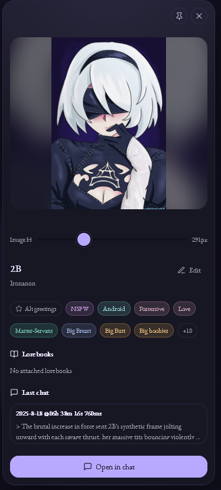
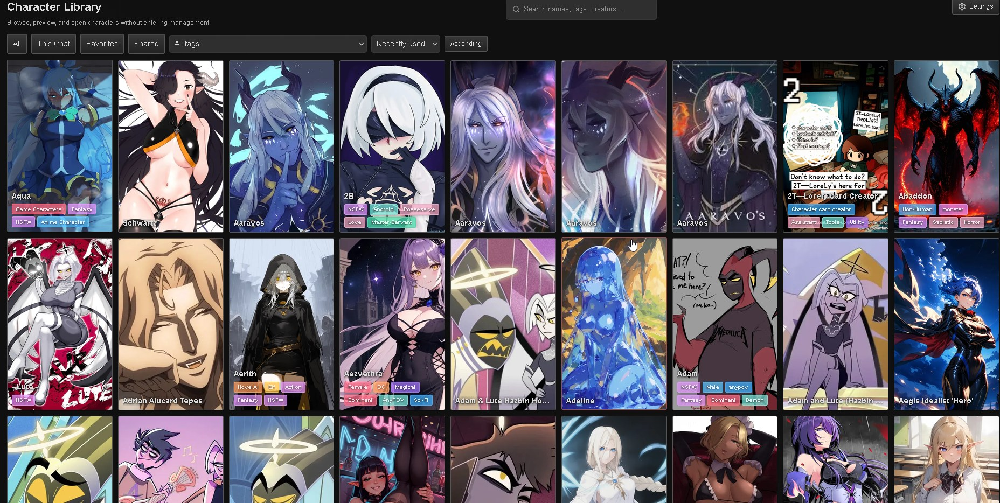

# Lumiverse Suite

`lumiverse_suite` is Lumiverse's single installable P19 frontend extension. It
ships a nine-module feature suite as one repository and one install record. The
module identifiers below are registry IDs, not independently installable
extensions.

## Feature showcase

The suite extends Lumiverse from the homepage through the full chat workflow. Start with the redesigned character library, then explore the connection, toolbar, lorebook, portrait, and customization surfaces included in the extension.

### Homepage character library

`homepage_library`, `character_display`, and `character_library_scope` turn the homepage into a searchable visual library with filters, sorting, tags, favorites, scope controls, theme support, and infinite scrolling.

[](docs/showcase/homepage-character-library.jpg)

Open a character profile directly from the library to review its portrait, metadata, tags, attached lorebooks, and latest chat.

<p align="center">
  <a href="docs/showcase/homepage-character-profile.png">
    
  </a>
</p>

The library inherits the active Lumiverse theme.

[](docs/showcase/homepage-alternate-theme.jpg)

### Connections picker

`connections_picker` provides one searchable surface for providers, models, saved connections, profiles, and tags.

https://github.com/user-attachments/assets/88ede26c-b8af-4115-b45f-25cf3798ad87

### Quick toolbar

`quick_toolbar` keeps frequent actions close to the conversation and supports both compact and expanded layouts.

#### Compact toolbar

https://github.com/user-attachments/assets/a99bfb98-0a02-4e38-9b89-66ae886cbfcb

#### Expanded toolbar

https://github.com/user-attachments/assets/d3b15b7e-4433-43d0-a673-84fe1861551f

### Lorebook workflow

`lore_indicator`, `lorebook_token_counts`, and `lorebook_workspace` surface active entries and token impact while offering floating, split, and full-workspace editing modes.

#### Lore panel

https://github.com/user-attachments/assets/ae205559-25c2-459a-80ab-05507d36cd3d

#### Docked indicators

https://github.com/user-attachments/assets/05afb85d-c5d0-49c2-8ff2-5b3daf6a6ea4

#### Floating editor

https://github.com/user-attachments/assets/3e827a3e-ec43-4e07-a791-8358a8478e02

#### Split editor

https://github.com/user-attachments/assets/084a1927-35b2-4419-9c25-8d0fcae9f318

#### Full workspace

https://github.com/user-attachments/assets/c4ee4eb4-dccf-4ae2-9731-cb8276d12c46

### Character portrait dock

`portrait_dock` can pin, resize, reposition, dock, or float the active character portrait without covering the conversation.

https://github.com/user-attachments/assets/ebb40af0-09e5-4712-a6af-300c41d52320

### Suite settings

Configure toolbar actions and order, picker variants and dimensions, library density and metadata, lorebook presentation, and portrait behavior from the suite's settings surfaces.

https://github.com/user-attachments/assets/f7d688af-d1b7-4dca-bd96-8cf4d895c9f9

## Identity and layout

- Source: `spindle-extensions/lumiverse_suite/`
- Installed identity: `lumiverse_suite`
- Frontend entry: `src/index.ts` exports `setup`; the browser ESM build writes
  `dist/frontend.js`.
- Backend entry: none. `spindle.json` declares `entry_frontend` only.
- Manifest: `spindle.json`, including the literal JSON field `"dev_mode": true`
  and the suite's declared permission union.
- Type dependency: this package pins `lumiverse-spindle-types` to `0.6.12` in
  `package.json`.

The current P19 registry contains:

- `quick_toolbar` — host action and command toolbar.
- `lore_indicator` — activated-lore indicators and their display variants.
- `connections_picker` — connection, profile, model, and tag picker.
- `portrait_dock` — portrait dock and image-preview surface.
- `character_display` — character display/grid and its settings surfaces.
- `character_library_scope` — mine/shared character-library scope controls.
- `lorebook_token_counts` — token-count badges for world-book entries.
- `lorebook_workspace` — world-book entry table and editor workspace.
- `homepage_library` — homepage character library and preview.

All nine modules are registered by `src/frontend.ts` and share the suite
lifecycle. They are not separate manifests, packages, deployment targets, or
database identities.

## Runtime behavior

- `setup(ctx)` installs the lifecycle-owned theme bridge, starts the registered
  modules, and returns an asynchronous teardown function. Teardown stops modules
  in reverse order, disposes module styles and the suite bus, and removes
  suite-owned module nodes; repeated teardown is safe.
- Module enable settings control whether a module mounts its resources. When
  disabled, a module removes all suite-owned presentation resources, styles,
  listeners, watches, and settings registrations. Host-owned/native content is
  preserved; disabling a module removes its handlers and injections so native
  behavior resumes. Host adapters prefer native surfaces and only create
  clearly suite-owned fallback roots when a host surface is unavailable.
- Suite settings are namespaced as
  `spindle:lumiverse_suite:<module>:<key>`.
- Manifest permissions are declarations, not startup prompts. Starting the
  suite, enabling a module, and inspecting read-only host surfaces do not request
  permission. A protected action requests exactly the one capability it needs,
  immediately before the action, through
  `ctx.permissions.request([permission], { reason })`. If the request is denied
  or fails, the action is not performed and no partial feature state is left
  behind.

## Build and test entrypoints

From this directory, use Bun:

```sh
bun install
bun run build
bun run test
```

`bun run build` bundles `src/index.ts` for the browser as ESM at
`dist/frontend.js`. `bun run test` invokes the package's `bun test` suite.
`bun run typecheck` and `bun run lint` are also available package scripts. Keep
`dist/` untracked so the host can perform its own frontend build.

## Local deployment

Deploy the entire suite as one transactional copy unit:

```text
spindle-extensions/lumiverse_suite/
  -> data/extensions/lumiverse_suite/repo/
```

`scripts/deploy-local-extensions.ts` stages a fresh sibling directory, validates
the suite, then replaces `repo/` with same-volume renames and rollback. It does
not overlay the live destination recursively or deploy module-specific targets.
After copying an update, rebuild, restart the host to resync the manifest and
permissions, then hard refresh.
